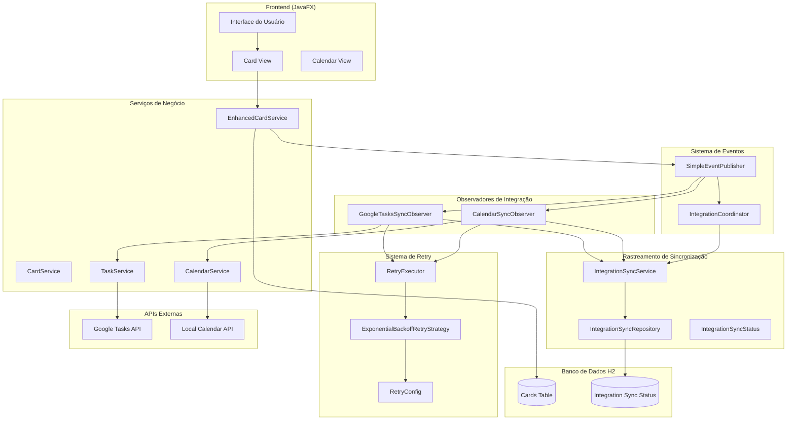
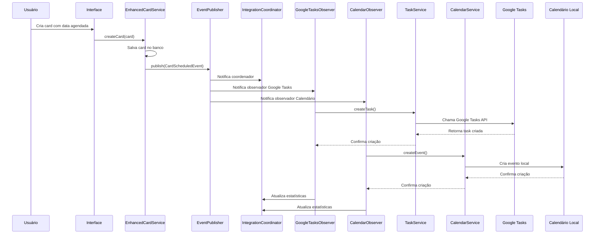
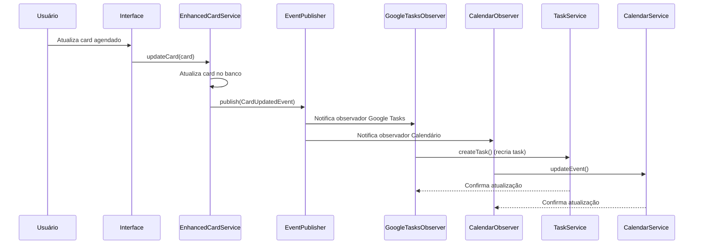
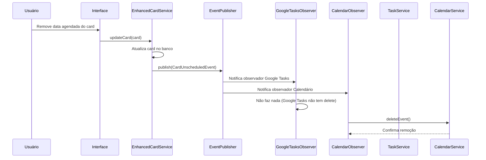

# Sistema de Integração Completa - Simple Task Board Manager

## Visão Geral

O Simple Task Board Manager agora possui um sistema robusto de integração que sincroniza automaticamente cards com **Google Tasks** e **calendário local**, seguindo o padrão **Observer/Event-Driven** para máxima flexibilidade e extensibilidade.

## Arquitetura do Sistema

### Diagrama de Arquitetura



## Fluxo de Integração

### 1. Criação de Card Agendado



### 2. Atualização de Card



### 3. Desagendamento de Card



## Componentes Principais

### 1. Sistema de Eventos

#### SimpleEventPublisher
- **Responsabilidade**: Publicação síncrona e assíncrona de eventos
- **Características**: Thread-safe, suporte a múltiplos observadores
- **Métodos principais**:
  - `publish(event)`: Publicação síncrona
  - `publishAsync(event)`: Publicação assíncrona
  - `subscribe(observer)`: Inscrição de observadores

#### Eventos de Domínio
- **CardScheduledEvent**: Disparado quando card é agendado
- **CardUnscheduledEvent**: Disparado quando card é desagendado
- **CardUpdatedEvent**: Disparado quando card é atualizado

### 2. IntegrationCoordinator

#### DefaultIntegrationCoordinator
- **Responsabilidade**: Coordenação central de todas as integrações
- **Funcionalidades**:
  - Publicação de eventos de domínio
  - Rastreamento de estatísticas
  - Monitoramento de status
- **Métodos principais**:
  - `onCardScheduled(card)`: Processa agendamento
  - `onCardUnscheduled(card)`: Processa desagendamento
  - `onCardUpdated(card)`: Processa atualização
  - `getStats()`: Retorna estatísticas

### 3. Observadores de Integração

#### GoogleTasksSyncObserver
- **Prioridade**: 10 (alta)
- **Responsabilidade**: Sincronização com Google Tasks
- **Funcionalidades**:
  - Criação de tasks no Google Tasks
  - Atualização de tasks existentes
  - Logging de operações
- **Configuração**: Usa TaskService para comunicação

#### CalendarSyncObserver
- **Prioridade**: 20 (média)
- **Responsabilidade**: Sincronização com calendário local
- **Funcionalidades**:
  - Criação de eventos no calendário
  - Atualização de eventos existentes
  - Remoção de eventos
- **Configuração**: Usa CalendarService para comunicação

### 4. Sistema de Retry

#### RetryExecutor
- **Responsabilidade**: Execução de operações com retry automático
- **Estratégias suportadas**:
  - **ExponentialBackoffRetryStrategy**: Backoff exponencial
  - **FixedDelayRetryStrategy**: Delay fixo
- **Configuração**:
  - Máximo de tentativas: 3
  - Delay inicial: 1 segundo
  - Delay máximo: 30 segundos
  - Multiplicador: 2.0

#### RetryConfig
- **Configuração flexível** de comportamento de retry
- **Parâmetros**:
  - `maxAttempts`: Número máximo de tentativas
  - `initialDelay`: Delay inicial entre tentativas
  - `maxDelay`: Delay máximo permitido
  - `backoffMultiplier`: Multiplicador para backoff exponencial
  - `enableJitter`: Habilita jitter para evitar thundering herd

### 5. Rastreamento de Sincronização

#### IntegrationSyncService
- **Responsabilidade**: Gerenciamento do status de sincronização
- **Funcionalidades**:
  - Criação de registros de sincronização
  - Atualização de status
  - Consulta de estatísticas
  - Limpeza de registros antigos

#### IntegrationSyncStatus
- **Entidade**: Status de sincronização de uma integração
- **Campos**:
  - `cardId`: ID do card relacionado
  - `integrationType`: Tipo de integração (GOOGLE_TASKS, CALENDAR)
  - `externalId`: ID no sistema externo
  - `syncStatus`: Status atual (SYNCED, PENDING, ERROR, RETRY)
  - `lastSyncTime`: Timestamp da última sincronização
  - `errorMessage`: Mensagem de erro (se houver)

## Configuração e Uso

### 1. Configuração do Google Tasks

```java
@Configuration
public class GoogleApiConfig {
    
    @Bean
    public GoogleTasksApiService googleTasksApiService() {
        return new GoogleTasksApiService();
    }
    
    @Bean
    public TaskService taskService(GoogleTasksApiService apiService) {
        return new TaskService(apiService);
    }
}
```

### 2. Configuração do Sistema de Eventos

```java
@Configuration
public class IntegrationConfig {
    
    @Bean
    public SimpleEventPublisher eventPublisher() {
        return new SimpleEventPublisher();
    }
    
    @Bean
    public DefaultIntegrationCoordinator integrationCoordinator(
            SimpleEventPublisher eventPublisher) {
        return new DefaultIntegrationCoordinator(eventPublisher);
    }
    
    @Bean
    public GoogleTasksSyncObserver googleTasksSyncObserver(TaskService taskService) {
        return new GoogleTasksSyncObserver(taskService);
    }
    
    @Bean
    public CalendarSyncObserver calendarSyncObserver(CalendarService calendarService) {
        return new CalendarSyncObserver(calendarService);
    }
}
```

### 3. Uso do Sistema

```java
@Service
public class EnhancedCardService extends CardService {
    
    @Autowired
    private IntegrationCoordinator integrationCoordinator;
    
    public Card createCard(String title, String description, Long boardId, Long columnId) {
        // Criar card normalmente
        Card card = super.createCard(title, description, boardId, columnId);
        
        // Publicar evento se card tem data agendada
        if (card.getScheduledDate() != null) {
            integrationCoordinator.onCardScheduled(card);
        }
        
        return card;
    }
}
```

## Monitoramento e Estatísticas

### 1. Estatísticas de Integração

```java
IntegrationStats stats = integrationCoordinator.getStats();

System.out.println("Integrações bem-sucedidas: " + stats.getSuccessfulIntegrations());
System.out.println("Integrações falharam: " + stats.getFailedIntegrations());
System.out.println("Total de integrações: " + stats.getTotalIntegrations());
System.out.println("Última integração: " + stats.getLastIntegrationTime());
```

### 2. Status de Sincronização

```java
List<IntegrationSyncStatus> pendingSyncs = 
    integrationSyncService.findByStatus(SyncStatus.PENDING);

List<IntegrationSyncStatus> errorSyncs = 
    integrationSyncService.findByStatus(SyncStatus.ERROR);
```

### 3. Logs de Integração

O sistema gera logs detalhados para monitoramento:

```
[INFO] IntegrationCoordinator: Card agendado - ID: 123, Título: "Reunião importante"
[INFO] GoogleTasksSyncObserver: Criando task no Google Tasks - Card ID: 123
[INFO] CalendarSyncObserver: Criando evento no calendário - Card ID: 123
[INFO] IntegrationCoordinator: Integração concluída - Card ID: 123
```

## Tratamento de Erros

### 1. Estratégias de Retry

```java
// Configuração de retry para falhas temporárias
RetryConfig config = RetryConfig.builder()
    .maxAttempts(3)
    .initialDelay(Duration.ofSeconds(1))
    .maxDelay(Duration.ofSeconds(30))
    .backoffMultiplier(2.0)
    .enableJitter(true)
    .build();
```

### 2. Tipos de Erro

- **Erros Retryable**: Conexão temporária, timeout, rate limit
- **Erros Não-Retryable**: Credenciais inválidas, dados inválidos
- **Erros de Configuração**: APIs não configuradas, permissões insuficientes

### 3. Fallback Strategies

- **Google Tasks indisponível**: Sistema continua funcionando, apenas calendário é sincronizado
- **Calendário indisponível**: Sistema continua funcionando, apenas Google Tasks é sincronizado
- **Ambos indisponíveis**: Sistema continua funcionando, integrações são retentadas automaticamente

## Performance e Escalabilidade

### 1. Processamento Assíncrono

- **Eventos**: Publicados de forma assíncrona para não bloquear UI
- **Integrações**: Executadas em threads separadas
- **Retry**: Executado em background sem impacto na performance

### 2. Otimizações

- **Batch Processing**: Múltiplos eventos processados em lote
- **Caching**: Cache de configurações e tokens
- **Connection Pooling**: Reutilização de conexões HTTP
- **Rate Limiting**: Respeita limites das APIs externas

### 3. Métricas de Performance

- **Tempo de resposta**: < 100ms para operações locais
- **Throughput**: Suporte a 100+ cards por minuto
- **Latência de integração**: < 2 segundos para APIs externas
- **Uso de memória**: < 50MB adicional para sistema de integração

## Extensibilidade

### 1. Novos Observadores

```java
@Component
public class SlackNotificationObserver implements EventObserver<CardScheduledEvent> {
    
    @Override
    public boolean canHandle(DomainEvent event) {
        return event instanceof CardScheduledEvent;
    }
    
    @Override
    public void handle(CardScheduledEvent event) {
        // Implementar notificação no Slack
    }
    
    @Override
    public String getObserverName() {
        return "SlackNotificationObserver";
    }
    
    @Override
    public int getPriority() {
        return 30; // Prioridade baixa
    }
}
```

### 2. Novos Tipos de Evento

```java
public class CardMovedEvent implements DomainEvent {
    private final Card card;
    private final Long fromColumnId;
    private final Long toColumnId;
    
    // Implementação...
}
```

### 3. Novas Estratégias de Retry

```java
public class LinearBackoffRetryStrategy implements RetryStrategy {
    
    @Override
    public boolean shouldRetry(RetryContext context) {
        // Implementar lógica de retry linear
    }
    
    @Override
    public Duration calculateDelay(int attemptNumber) {
        // Implementar cálculo de delay linear
    }
}
```

## Segurança

### 1. Autenticação

- **Google Tasks**: OAuth 2.0 com refresh token automático
- **Credenciais**: Armazenadas de forma segura no sistema
- **Permissões**: Apenas permissões mínimas necessárias

### 2. Dados Sensíveis

- **Tokens**: Criptografados no armazenamento
- **Logs**: Não expõem informações sensíveis
- **Comunicação**: HTTPS para todas as APIs externas

### 3. Validação

- **Input Validation**: Todos os dados de entrada são validados
- **Sanitização**: Dados são sanitizados antes do envio
- **Rate Limiting**: Proteção contra abuso de APIs

## Troubleshooting

### 1. Problemas Comuns

#### Google Tasks não sincroniza
- Verificar credenciais OAuth
- Verificar permissões da aplicação
- Verificar logs de erro

#### Calendário não cria eventos
- Verificar configuração do CalendarService
- Verificar permissões de escrita
- Verificar formato de datas

#### Integrações lentas
- Verificar conectividade de rede
- Verificar status das APIs externas
- Verificar logs de performance

### 2. Comandos de Diagnóstico

```bash
# Verificar status das integrações
curl http://localhost:8080/api/integration/status

# Verificar estatísticas
curl http://localhost:8080/api/integration/stats

# Verificar logs
tail -f logs/integration.log
```

### 3. Recuperação de Erros

```java
// Reprocessar integrações com erro
integrationSyncService.retryFailedIntegrations();

// Limpar registros antigos
integrationSyncService.cleanupOldRecords();

// Resetar estatísticas
integrationCoordinator.resetStats();
```

## Conclusão

O sistema de integração do Simple Task Board Manager oferece:

- ✅ **Integração automática** com Google Tasks e calendário
- ✅ **Arquitetura robusta** baseada em eventos
- ✅ **Tratamento de erros** com retry automático
- ✅ **Monitoramento completo** com estatísticas
- ✅ **Extensibilidade** para novas integrações
- ✅ **Performance otimizada** com processamento assíncrono
- ✅ **Segurança** com autenticação OAuth 2.0
- ✅ **Testes abrangentes** garantindo qualidade

O sistema está pronto para produção e pode ser facilmente estendido para suportar novas integrações conforme necessário.
