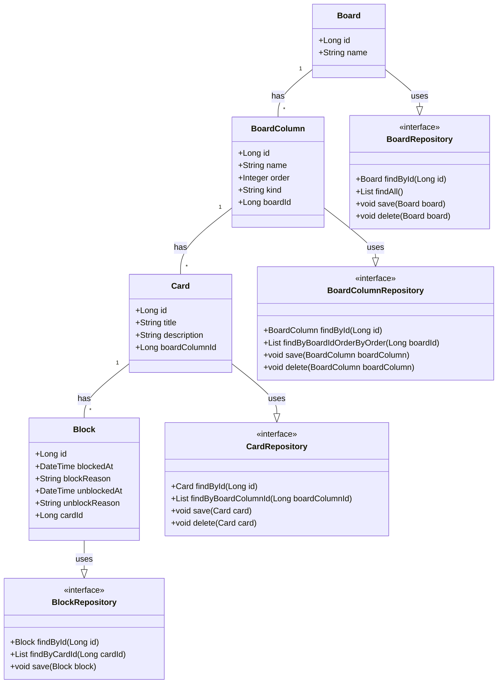

# Gerenciador de boards de tarefas

  

Projeto desenvolvido para finalização do Bootcamp Bradesco Java <a href="https://www.dio.me" target="_blank">DIO</a> 

  <a href="#tecnologias">Tecnologias</a>&nbsp;&nbsp;&nbsp;|&nbsp;&nbsp;&nbsp;
  <a href="#funcionalidades">Funcionalidades</a>&nbsp;&nbsp;&nbsp;|&nbsp;&nbsp;&nbsp;
  <a href="#desafio">Desafio</a>&nbsp;&nbsp;&nbsp;|&nbsp;&nbsp;&nbsp;
  <a href="#requisitos">Requisitos</a>&nbsp;&nbsp;&nbsp;|&nbsp;&nbsp;&nbsp;
  <a href="#sugestoes">Sugestões de buscas relacionadas</a>&nbsp;&nbsp;&nbsp;|&nbsp;&nbsp;&nbsp;
  <a href="#diagrama">Diagrama UML inicial</a>

## 
🚀 Tecnologias

Esse projeto foi desenvolvido com as seguintes tecnologias:

- ☕ Java
- 💾 Sqlite ~~Mysql~~
- 🖥️ JavaFX

## 
Funcionalidades

- Criar e excluir board de tarefas
- Criar cards
- Editar título e descrição dos cards com duplo clique do mouse
- Mover cards entre as colunas não iniciado, em andamento e concluído usando o drag and drop

## 
Desafio

Board para Gerenciamento de Tarefas simples criado a partir de desafio do Bootcamp Bradesco Java DIO. 

O desafio abordou todas as etapas do desenvolvimento, desde o planejamento e estruturação até a implementação de funcionalidades como gerenciamento de dados e integração entre camadas, seguindo boas práticas de programação.

## 
Diagrama UML inicial

