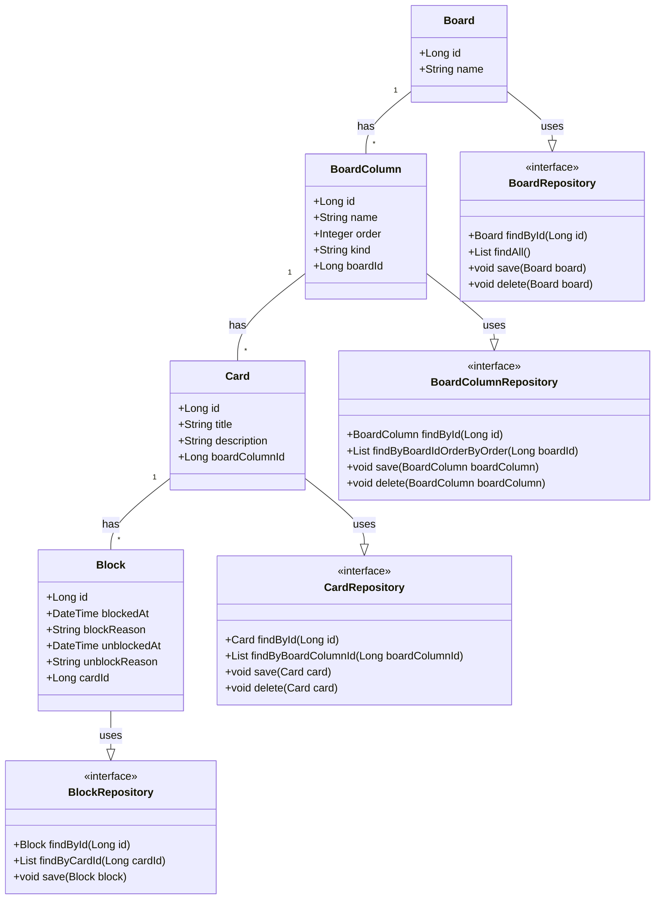

# Gerenciador de boards de tarefas

  

Projeto desenvolvido para finalização do Bootcamp Bradesco Java <a href="https://www.dio.me" target="_blank">DIO</a> 

  <a href="#tecnologias">Tecnologias</a>&nbsp;&nbsp;&nbsp;|&nbsp;&nbsp;&nbsp;
  <a href="#funcionalidades">Funcionalidades</a>&nbsp;&nbsp;&nbsp;|&nbsp;&nbsp;&nbsp;  
  <a href="#desafio">Desafio</a>&nbsp;&nbsp;&nbsp;|&nbsp;&nbsp;&nbsp;
  <a href="#migracao">Migração para JPA/Hibernate</a>&nbsp;&nbsp;&nbsp;|&nbsp;&nbsp;&nbsp;
  <a href="#diagrama">Diagrama UML inicial</a>

## 
🚀 Tecnologias

Esse projeto foi desenvolvido com as seguintes tecnologias:

- ☕ Java
- 💾 Sqlite
- 🐘 JPA/Hibernate
- 🖥️ JavaFX

## 
Funcionalidades

- Criar e excluir board de tarefas
- Criar cards
- Editar título e descrição dos cards com duplo clique do mouse
- Mover cards entre as colunas não iniciado, em andamento e concluído usando o drag and drop
- Método de cálculo do % não inciado, em andamento e concluído dos boards
- Persistência de dados com banco de dados locais SQLite
- Integração com a **API do Google Tasks** para criar tarefas a partir dos cards

## 
Desafio

Board para Gerenciamento de Tarefas simples criado a partir de desafio do Bootcamp Bradesco Java DIO. 

O desafio abordou todas as etapas do desenvolvimento, desde o planejamento e estruturação até a implementação de funcionalidades como gerenciamento de dados e integração entre camadas, seguindo boas práticas de programação.

A partir dessa provocação eu expandi e desenvolvi mais funcionalidades para o projeto.

## 
Migração para JPA/Hibernate

O projeto passou por uma refatoração significativa, migrando da persistência manual com JDBC para o uso do **JPA (Jakarta Persistence API)** com a implementação do **Hibernate**. Essa mudança modernizou a camada de dados, trazendo mais robustez, manutenibilidade e produtividade.

### Principais Alterações

- **Mapeamento Objeto-Relacional (ORM)**: As classes de modelo (`BoardEntity`, `CardEntity`, etc.) foram transformadas em entidades JPA com anotações como `@Entity`, `@Id`, `@OneToMany` e `@ManyToOne`. Isso eliminou a necessidade de escrever SQL manualmente para operações CRUD.

- **Camada de Serviço Refatorada**: As classes `BoardService` e `CardService` foram completamente reescritas para utilizar o `EntityManager` do JPA. Toda a lógica de transação (iniciar, comitar, reverter) e operações de persistência (`persist`, `merge`, `remove`, `find`) agora são gerenciadas pelo Hibernate.

- **Configuração Centralizada**: A configuração do banco de dados foi centralizada no arquivo `src/main/resources/META-INF/persistence.xml`, definindo o dialeto do SQLite, o driver e outras propriedades do Hibernate.

- **Gerenciamento de Conexão com `JPAUtil`**: Foi criada a classe `JPAUtil` para gerenciar o ciclo de vida do `EntityManagerFactory` (que é custoso e criado apenas uma vez) e fornecer instâncias do `EntityManager` para cada transação.

- **Localização Dinâmica do Banco de Dados**: A aplicação agora salva o arquivo do banco de dados (`myboard.db`) de forma dinâmica na pasta `MyBoards` dentro do diretório do usuário (ex: `C:\Users\username\MyBoards`), garantindo que os dados não sejam perdidos e que a aplicação seja mais portável.

### Desafios Superados Durante a Migração

A migração para um framework ORM robusto como o Hibernate trouxe desafios de aprendizado que foram superados:

- **`LazyInitializationException`**: Resolvido através do uso de `JOIN FETCH` em consultas JPQL para garantir que coleções "preguiçosas" fossem carregadas junto com suas entidades pai antes de a sessão ser fechada.

- **`MultipleBagFetchException`**: Contornado ao implementar uma estratégia de busca em duas etapas, carregando primeiro a coleção principal e, em uma segunda consulta, as coleções aninhadas, evitando o "produto cartesiano" indesejado.

- **`orphanRemoval`**: O comportamento de exclusão inesperada de cards foi corrigido ajustando a lógica de negócio para modificar apenas o lado "dono" (`@ManyToOne`) da relação, permitindo que o Hibernate gerencie a sincronização das coleções corretamente.

### Benefícios Obtidos

- **Redução de Código Boilerplate**: Eliminação de blocos `try-catch-finally` para gerenciamento de `Connection`, `Statement` e `ResultSet`.
- **Código Mais Legível e Declarativo**: A lógica de persistência se tornou mais clara e focada no modelo de domínio.
- **Segurança e Integridade**: Gerenciamento de transações mais seguro e explícito.
- **Independência de Banco de Dados**: Embora o projeto use SQLite, a arquitetura agora facilita a troca para outro banco de dados com alterações mínimas.

## 
Diagrama UML inicial

