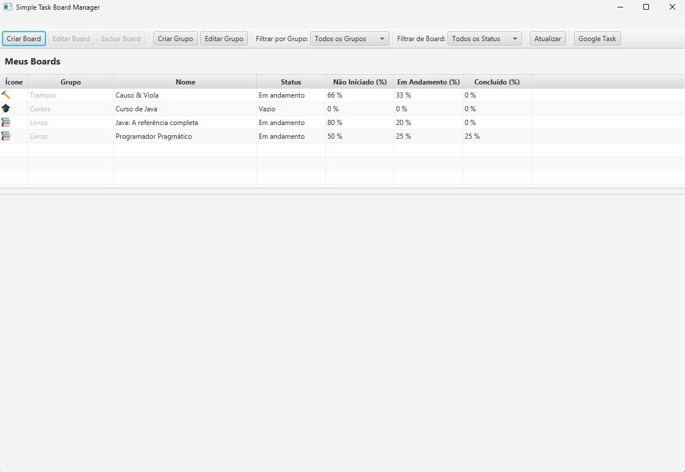

# Simple Task Board Manager

<p align="center">
  <a href="https://github.com/lgjor/desafio-board-dio" target="_blank">
    
  </a>
</p>

<p align="center">
Aplicação desktop simples e eficiente para gerenciamento de tarefas<br/>
Desenvolvido para manter você focado no que realmente importa: **resolver suas tarefas**
</p>

<p align="center">
  <a href="#diferencial">Diferencial</a>&nbsp;&nbsp;&nbsp;|&nbsp;&nbsp;&nbsp;
  <a href="#tecnologias">Tecnologias</a>&nbsp;&nbsp;&nbsp;|&nbsp;&nbsp;&nbsp;
  <a href="#funcionalidades">Funcionalidades</a>&nbsp;&nbsp;&nbsp;|&nbsp;&nbsp;&nbsp;
  <a href="#arquitetura">Arquitetura</a>&nbsp;&nbsp;&nbsp;|&nbsp;&nbsp;&nbsp;
  <a href="#testes">Testes</a>&nbsp;&nbsp;&nbsp;|&nbsp;&nbsp;&nbsp;
  <a href="#changelog">Changelog</a>
</p>

## <div id="diferencial">🎯 Nosso Diferencial: Simplicidade que Foca na Produtividade</div>

Enquanto outras ferramentas de gerenciamento de tarefas oferecem inúmeras funcionalidades e configurações complexas, o **Simple Task Board Manager** foi desenvolvido com um propósito claro: **manter você focado na resolução de suas tarefas, não no uso da ferramenta**.

### Por que escolher nossa solução?

- **⚡ Zero Configuração**: Instale e use imediatamente - sem setups complexos
- **🎯 Interface Minimalista**: Apenas o essencial para gerenciar tarefas eficientemente
- **⏱️ Economia de Tempo**: Menos tempo configurando, mais tempo produzindo
- **🧠 Foco na Tarefa**: Interface limpa que não distrai do objetivo principal
- **💾 Persistência Local**: Seus dados ficam seguros no seu computador

> *"A melhor ferramenta é aquela que você esquece que está usando"*

## <div id="tecnologias">🚀 Tecnologias</div>

Este projeto foi desenvolvido com tecnologias modernas e estáveis:

- **☕ Java 21** - Linguagem principal com recursos modernos
- **🍃 Spring Boot 3.2.5** - Framework para injeção de dependências e configuração
- **💾 H2 Database 2.3.232** - Banco de dados em memória para persistência local
- **🖥️ JavaFX 21.0.4** - Interface gráfica moderna e responsiva
- **🔧 Gradle 8.14.3** - Sistema de build e gerenciamento de dependências
- **📊 Micrometer 1.15.2** - Observabilidade e métricas
- **🧪 JUnit 5 + Mockito** - Testes unitários e de integração
- **🔌 Google Tasks API** - Integração com Google Tasks (em desenvolvimento)

## <div id="funcionalidades">✨ Funcionalidades</div>

### Interface Intuitiva
- **📋 Boards Visuais**: Organize suas tarefas em colunas visuais (A Fazer, Em Andamento, Concluído)
- **🎴 Cards Interativos**: Crie e edite cards com duplo clique (edição in-place)
- **🔄 Drag & Drop**: Mova tarefas entre colunas com arrastar e soltar
- **📊 Progresso Visual**: Acompanhe o progresso com percentuais automáticos

### Produtividade
- **⚡ Início Rápido**: Sem configurações complexas - abra e use
- **💾 Persistência Automática**: Dados salvos automaticamente no banco local
- **🎨 Interface Limpa**: Design minimalista que não distrai
- **📱 Responsivo**: Interface adaptável a diferentes tamanhos de tela

### Recursos Avançados
- **🔍 Busca e Filtros**: Encontre rapidamente suas tarefas
- **📅 Datas e Prazos**: Acompanhe prazos e datas de criação/conclusão
- **🔄 Sincronização**: Integração com Google Tasks (em desenvolvimento)
- **📊 Relatórios**: Visualize seu progresso e produtividade

## <div id="arquitetura">🏗️ Arquitetura</div>

O projeto evoluiu de uma arquitetura simples para uma solução robusta e escalável, mantendo sempre o foco na simplicidade de uso.

### Evolução da Arquitetura

#### **Fase 1: Fundação Sólida**
- **JDBC → JPA/Hibernate**: Migração para mapeamento objeto-relacional moderno
- **Entidades JPA**: Modelo de dados limpo com anotações (`@Entity`, `@Id`, `@OneToMany`)
- **Serviços Transacionais**: Gerenciamento automático de transações com `@Transactional`

#### **Fase 2: Spring Boot Integration**
- **Injeção de Dependência**: Spring gerencia o ciclo de vida dos componentes
- **Arquitetura Modular**: Componentes desacoplados e reutilizáveis
- **Configuração Automática**: Spring Boot configura automaticamente o ambiente

#### **Fase 3: Interface Moderna**
- **JavaFX Components**: Interface baseada em componentes FXML reutilizáveis
- **Padrão Observer**: Comunicação desacoplada entre componentes via callbacks
- **UX Aprimorada**: Edição in-place, drag & drop, feedback visual

### Benefícios da Arquitetura Atual

- **🔧 Manutenibilidade**: Código organizado e fácil de manter
- **🧪 Testabilidade**: Arquitetura que facilita testes unitários e de integração
- **📈 Escalabilidade**: Fácil adição de novas funcionalidades
- **🛡️ Robustez**: Tratamento de erros e validações adequadas

## <div id="testes">🧪 Testes</div>

Para garantir qualidade e estabilidade, o projeto conta com uma suíte abrangente de testes:

### **Testes Unitários**
- **Services**: Validação da lógica de negócio isolada
- **Repositories**: Testes de acesso a dados
- **Validators**: Verificação de regras de validação

### **Testes de Integração**
- **Spring Context**: Testes que carregam o contexto completo
- **Database Integration**: Validação da persistência com H2
- **API Integration**: Testes de integração com Google Tasks API

### **Cobertura de Testes**
- **JUnit 5**: Framework moderno de testes
- **Mockito**: Mocking de dependências
- **Spring Boot Test**: Utilitários para testes de integração

## 🚀 Como Usar

1. **Download**: Baixe o instalador para Windows
2. **Instale**: Execute o instalador e siga as instruções
3. **Execute**: Abra o aplicativo e comece a usar imediatamente
4. **Produza**: Foque nas suas tarefas, não na ferramenta

## 💾 Preservação de Dados

O sistema garante que seus dados sejam preservados durante atualizações:

### **Backup Automático**
- Scripts de backup para Linux/Mac e Windows
- Backups salvos em `~/myboards/backups/`
- Metadados incluídos em cada backup

### **Migrações Automáticas**
- Liquibase gerencia migrações de banco automaticamente
- Dados existentes são preservados durante atualizações
- Verificação de integridade automática

### **Processo de Atualização Segura**
```bash
# 1. Backup (antes da atualização)
./scripts/backup-database.sh

# 2. Instalar nova versão
# O instalador preserva ~/myboards/

# 3. Verificar integridade
./scripts/check-database.sh
```

**📖 [Guia Completo de Atualização](ATUALIZACAO_BANCO_DADOS.md)**

## 📦 Instalação

### Windows
```bash
# Execute o instalador gerado
./gradlew jpackage
```

### Desenvolvimento
```bash
# Clone o repositório
git clone https://github.com/lgjor/simple-task-board-manager.git

# Execute com Gradle
./gradlew run

# Ou compile e execute
./gradlew build
java -jar build/libs/simple-task-board-manager-1.0.0-all.jar
```

## <div id="changelog">📋 Changelog</div>

### [v1.2.0] - 2025-01-08

#### ✨ Melhorias na Interface
- **Controles de Movimentação**: Adicionados botões ↑/↓ para mover cards dentro da mesma coluna
- **Posicionamento Otimizado**: Controles de movimentação posicionados no canto superior direito do card
- **Feedback Visual**: Remoção de alertas redundantes - interface atualizada automaticamente após movimentação
- **Tooltips Informativos**: Dicas visuais nos botões de movimentação

#### 🔧 Correções Técnicas
- **Validação de Dados**: Corrigido erro de validação que impedia atualização da interface
- **Atualização em Tempo Real**: Interface agora atualiza automaticamente após movimentação de cards
- **Lógica de Movimentação**: Corrigida query SQL para encontrar cards adjacentes corretamente
- **Comunicação entre Controllers**: Melhorada notificação entre CardViewController e BoardViewController

#### 🎨 Melhorias de UX
- **Interface Mais Limpa**: Removidos alertas desnecessários para movimentação bem-sucedida
- **Feedback Imediato**: Usuário vê mudanças instantaneamente na interface
- **Experiência Fluida**: Movimentação de cards sem interrupções na interface

### [v1.0.9] - 2025-01-07

#### ✨ Novas Funcionalidades
- **Sistema de Progresso**: Cards agora exibem progresso visual com percentuais
- **Controles de Edição**: Interface de edição in-place com spinners para progresso
- **Validação em Tempo Real**: Validação automática de valores de progresso
- **Status Dinâmico**: Status do card baseado na coluna atual

#### 🔧 Melhorias Técnicas
- **Arquitetura Modular**: Componentes reutilizáveis e desacoplados
- **Persistência Robusta**: Sistema de backup e migração de dados
- **Interface Responsiva**: Adaptação a diferentes tamanhos de tela

### [v1.0.8] - 2025-01-06

#### 🎉 Lançamento Inicial
- **Interface Kanban**: Boards visuais com colunas organizacionais
- **Drag & Drop**: Movimentação intuitiva de cards entre colunas
- **Persistência Local**: Banco de dados H2 para armazenamento local
- **Arquitetura Spring Boot**: Base sólida para desenvolvimento futuro

## 🤝 Contribuindo

Contribuições são bem-vindas! Mantenha sempre o foco na **simplicidade e produtividade do usuário**.

## 📄 Licença

Este projeto está sob a licença GNU General Public License v3.0. Veja o arquivo [LICENSE](LICENSE) para mais detalhes.

---

**Desenvolvido com ❤️ para manter você focado no que realmente importa: suas tarefas.**
