# Gerenciador de boards de tarefas

  

Projeto desenvolvido para finalização do Bootcamp Bradesco Java <a href="https://www.dio.me" target="_blank">DIO</a> 

  <a href="#tecnologias">Tecnologias</a>&nbsp;&nbsp;&nbsp;|&nbsp;&nbsp;&nbsp;
  <a href="#desafio">Desafio</a>&nbsp;&nbsp;&nbsp;|&nbsp;&nbsp;&nbsp;
  <a href="#requisitos">Requisitos</a>&nbsp;&nbsp;&nbsp;|&nbsp;&nbsp;&nbsp;
  <a href="#sugestoes">Sugestões de buscas relacionadas</a>&nbsp;&nbsp;&nbsp;|&nbsp;&nbsp;&nbsp;
  <a href="#diagrama">Diagrama UML inicial</a>

## 
🚀 Tecnologias

Esse projeto foi desenvolvido com as seguintes tecnologias:

- Java
- Mysql
- JavaFX

## 
Desafio

Aprenda a criar um board de tarefas em Java, passando por todas as etapas do desenvolvimento, desde o planejamento e estruturação até a implementação de funcionalidades como gerenciamento de dados e integração entre camadas, seguindo boas práticas de programação.

Projeto de Board para Gerenciamento de Tarefas
Escreva um código que irá criar um board customizável para acompanhamento de tarefas.

## 
Requisitos

1. O código deve iniciar disponibilizando um menu com as seguintes opções: Criar novo board, Selecionar board, Excluir board.
2. O código deve salvar o board com suas informações no banco de dados MySQL.

## Regras dos boards
1. Um board deve ter um nome e ser composto por pelo menos 3 colunas (coluna onde o card é colocado inicialmente, uma coluna de "Em andamento" e uma coluna de "Concluído").
2. As colunas têm seu respectivo nome, ordem que aparece no board e seu tipo (Inicial, cancelamento, final e pendente).
3. Cada board só pode ter 1 coluna do tipo inicial, cancelamento e final, colunas do tipo pendente podem ter quantas forem necessárias.
4. As colunas podem ter 0 ou N cards, cada card tem o seu título, descrição, data de criação e se está bloqueado.
5. Um card deve navegar nas colunas seguindo a ordem delas no board, sem pular nenhuma etapa, exceto pela coluna de cancelamento e final.
6. Se um card estiver marcado como bloqueado ele não pode ser movido até ser desbloqueado.
7. Para bloquear um card deve-se informar o motivo de seu bloqueio e para desbloqueá-lo deve-se também informar o motivo do desbloqueio.

## 
Sugestões de buscas relacionadas

Essas buscas devem retornar tutoriais, exemplos de código e até mesmo projetos completos que implementam funcionalidades semelhantes às descritas. Você poderá encontrar diferentes abordagens e escolher aquela que melhor se adapta às suas necessidades e nível de conhecimento.

- [Projeto de board de tarefas Python MySQL](https://www.google.com/search?q=Projeto+de+board+de+tarefas+Python+MySQL&oq=Projeto+de+board+de+tarefas+Python+MySQL&gs_lcrp=EgZjaHJvbWUyBggAEEUYOTIHCAEQIRigATIHCAIQIRigATIHCAMQIRigAdIBBzcxNGowajeoAgCwAgA&sourceid=chrome&ie=UTF-8)
- [Sistema de gerenciamento de tarefas com banco de dados](https://www.google.com/search?q=%22Sistema+de+gerenciamento+de+tarefas+com+banco+de+dados%22&sca_esv=177fae3e0b1a050b&sxsrf=AHTn8zoq0rYtf5vlh5AmnquP7S7NpgPnyQ%3A1746708958121&ei=3qkcaKGWB_rW1sQPj4qo0AQ&ved=0ahUKEwih_eX39ZONAxV6q5UCHQ8FCkoQ4dUDCBA&uact=5&oq=%22Sistema+de+gerenciamento+de+tarefas+com+banco+de+dados%22&gs_lp=Egxnd3Mtd2l6LXNlcnAiOCJTaXN0ZW1hIGRlIGdlcmVuY2lhbWVudG8gZGUgdGFyZWZhcyBjb20gYmFuY28gZGUgZGFkb3MiMggQABiABBiiBDIIEAAYogQYiQUyCBAAGIAEGKIEMggQABiiBBiJBUisFlAAWNERcAB4AJABAJgB7QGgAaAEqgEFMC4yLjG4AQPIAQD4AQL4AQGYAgOgAq0EwgIFECEYoAGYAwCSBwUwLjIuMaAH_guyBwUwLjIuMbgHrQQ&sclient=gws-wiz-serp)
- [Código para criar quadro Kanban com persistência em MySQL](https://www.google.com/search?q=%22C%C3%B3digo+para+criar+quadro+Kanban+com+persist%C3%AAncia+em+MySQL%22&sca_esv=177fae3e0b1a050b&sxsrf=AHTn8zqS5WcUG44gYsSTAECMfcJ7E-lhkQ%3A1746709085833&ei=XaocaLDWMrrR1sQP9Z7qsAQ&ved=0ahUKEwjw-Ni09pONAxW6qJUCHXWPGkYQ4dUDCBA&uact=5&oq=%22C%C3%B3digo+para+criar+quadro+Kanban+com+persist%C3%AAncia+em+MySQL%22&gs_lp=Egxnd3Mtd2l6LXNlcnAiPSJDw7NkaWdvIHBhcmEgY3JpYXIgcXVhZHJvIEthbmJhbiBjb20gcGVyc2lzdMOqbmNpYSBlbSBNeVNRTCIyBRAhGKABSOsJUABY1QdwAHgBkAEAmAGuAaABsgKqAQMwLjK4AQPIAQD4AQL4AQGYAgGgAq8BmAMAkgcDMC4xoAetBbIHAzAuMbgHrwE&sclient=gws-wiz-serp)
- [Aplicação de acompanhamento de tarefas com menu e banco de dados](https://www.google.com/search?q=%22Aplica%C3%A7%C3%A3o+de+acompanhamento+de+tarefas+com+menu+e+banco+de+dados%22&sca_esv=177fae3e0b1a050b&sxsrf=AHTn8zrZN-D7QHA92LeHAQQvPlCTl1Bw9A%3A1746709101659&ei=baocaNSAKNnT1sQP0Y7J4QY&ved=0ahUKEwiU65689pONAxXZqZUCHVFHMmwQ4dUDCBA&uact=5&oq=%22Aplica%C3%A7%C3%A3o+de+acompanhamento+de+tarefas+com+menu+e+banco+de+dados%22&gs_lp=Egxnd3Mtd2l6LXNlcnAiRCJBcGxpY2HDp8OjbyBkZSBhY29tcGFuaGFtZW50byBkZSB0YXJlZmFzIGNvbSBtZW51IGUgYmFuY28gZGUgZGFkb3MiSLoHULgBWLgBcAF4AZABAJgBvQGgAb0BqgEDMC4xuAEDyAEA-AEC-AEBmAIBoAIDwgIKEAAYsAMY1gQYR5gDAIgGAZAGCJIHATGgB3qyBwC4BwA&sclient=gws-wiz-serp)

```mermaid
classDiagram
class Board {
+Long id
+String name
}
class BoardColumn {
    +Long id
    +String name
    +Integer order
    +String kind
    +Long boardId
}
class Card {
    +Long id
    +String title
    +String description
    +Long boardColumnId
}
class Block {
    +Long id
    +DateTime blockedAt
    +String blockReason
    +DateTime unblockedAt
    +String unblockReason
    +Long cardId
}
class BoardRepository {
    <<interface>>
    +Board findById(Long id)
    +List<Board> findAll()
    +void save(Board board)
    +void delete(Board board)
}
class BoardColumnRepository {
    <<interface>>
    +BoardColumn findById(Long id)
    +List<BoardColumn> findByBoardIdOrderByOrder(Long boardId)
    +void save(BoardColumn boardColumn)
    +void delete(BoardColumn boardColumn)
}
class CardRepository {
    <<interface>>
    +Card findById(Long id)
    +List<Card> findByBoardColumnId(Long boardColumnId)
    +void save(Card card)
    +void delete(Card card)
}
class BlockRepository {
    <<interface>>
    +Block findById(Long id)
    +List<Block> findByCardId(Long cardId)
    +void save(Block block)
}
Board "1" -- "*" BoardColumn : has
BoardColumn "1" -- "*" Card : has
Card "1" -- "*" Block : has
Board --|> BoardRepository : uses
BoardColumn --|> BoardColumnRepository : uses
Card --|> CardRepository : uses
Block --|> BlockRepository : uses
```

## 
Diagrama UML inicial

